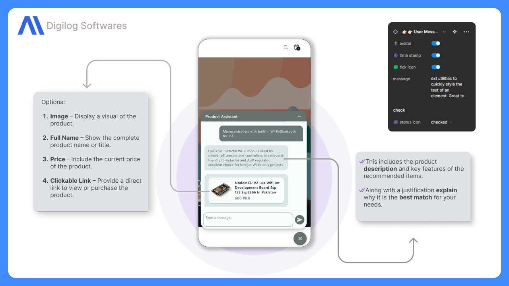
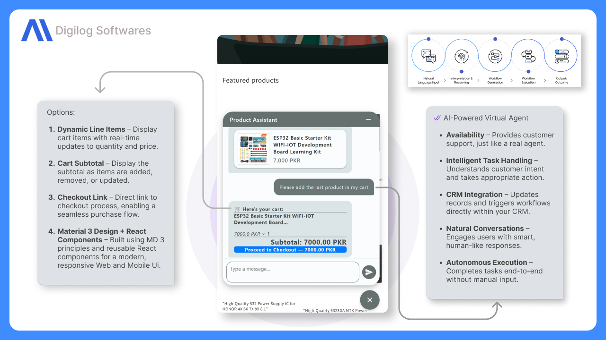
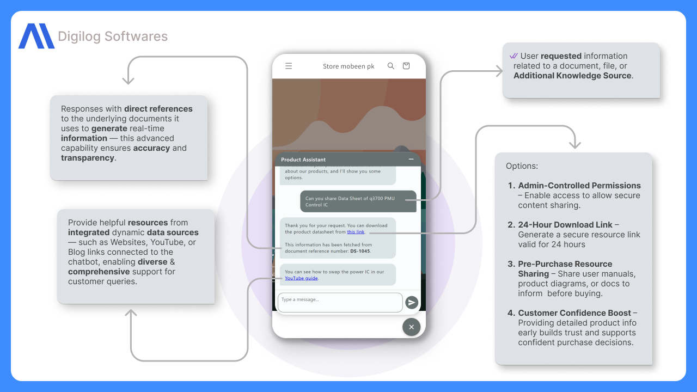
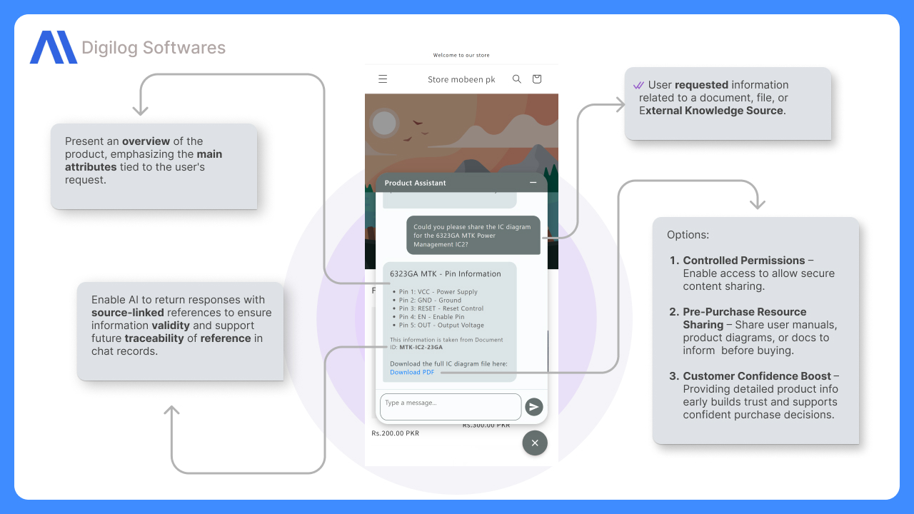
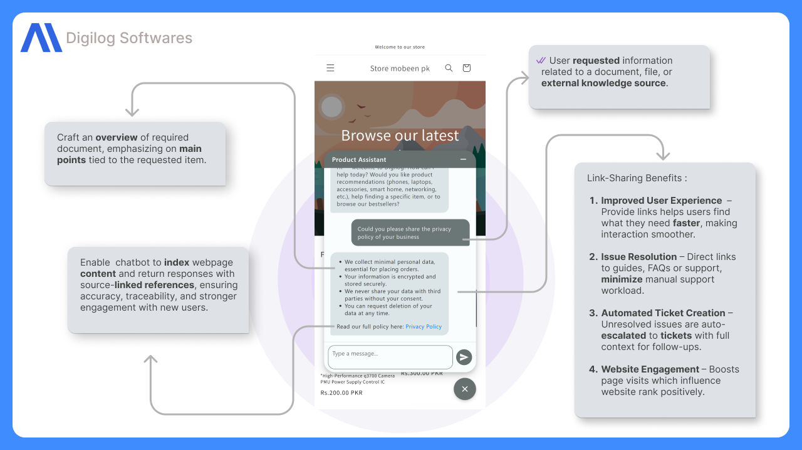
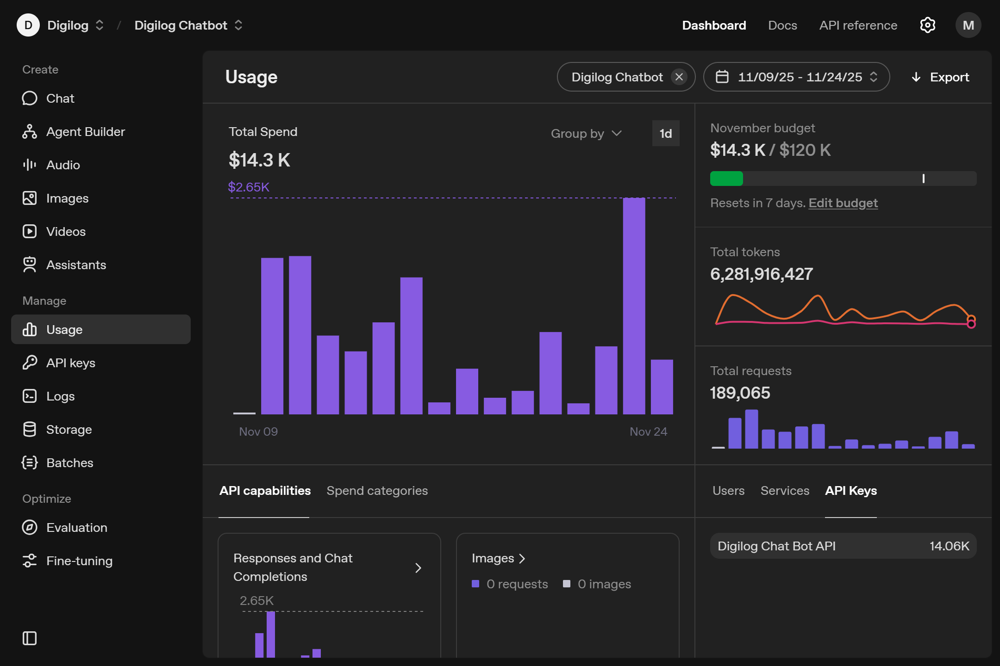
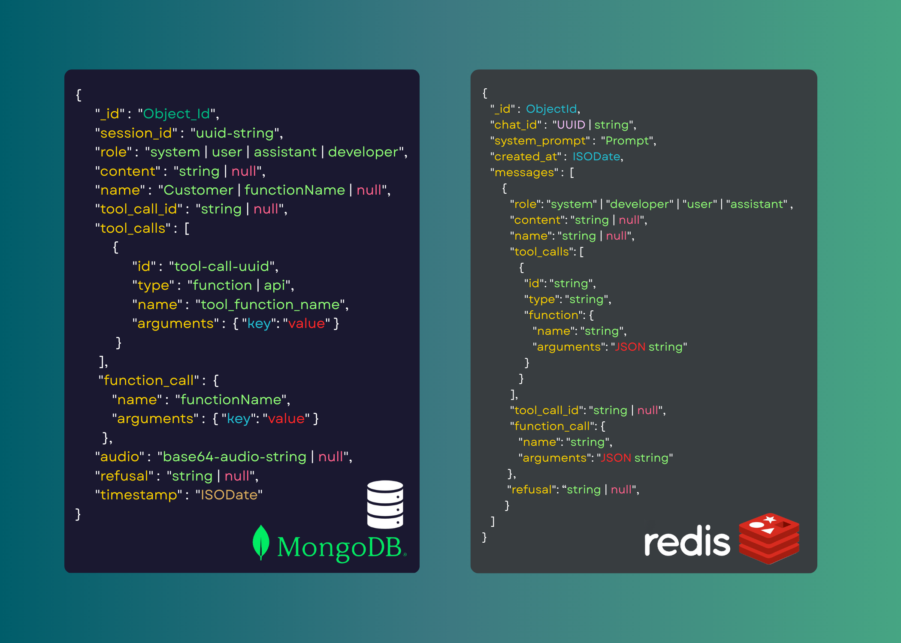

# UI Design & Documentation Showcase

This document provides a structured overview of the UI assets and documentation located in `\content\ui\`.

---

## 📄 Core Documentation
*Primary reference files for the project.*

1. **Primary Overview**
   * **File:** 

---

## 🖼️ Visual Assets
*Interface captures and design elements, sorted in ascending order.*
 
 
 
 
 
 
 

---
*Last Updated: February 13, 2026*