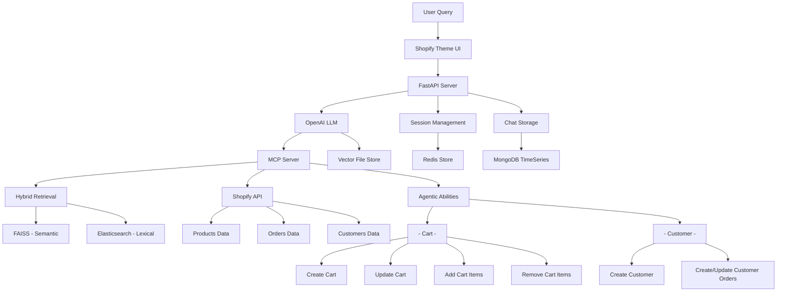

# Shopify ChatBot

An intelligent commerce assistant built for seamless Shopify storefront integration, leveraging advanced NLP and hybrid retrieval systems for enhanced customer experiences.

## Features

- 🤖 **AI-Powered Conversations**  
  OpenAI LLM integration for natural, context-aware dialogue with customers.  

- 🔍 **Hybrid Search**  
  FAISS semantic search combined with Elasticsearch lexical matching for highly accurate product discovery.  

- 🛒 **Real-time Shopify Integration**  
  Live access to products, customer accounts, and orders with seamless sync.  

- 🧩 **Agentic Shopping Assistant**  
  Smart, autonomous actions to:  
  - Create, add, edit, and delete products from the cart  
  - Finalize checkout flows  
  - Handle customer account creation & authentication  
  - Manage order status, updates, and tracking  

- 💾 **Persistent Sessions**  
  Redis for active user sessions and MongoDB for chat history to ensure continuity across conversations.  

- 🎨 **Theme Integration**  
  Native Shopify theme extension for an on-brand, seamless customer experience.  

- 🐳 **Containerized Deployment**  
  Docker-based infrastructure with CI/CD pipelines for reliable, scalable deployment. 

## Tech Stack

### Backend
- **Language**: Python 3.10+ (with async support)
- **Framework**: FastAPI / Async ( `Async` support for high-concurrency operations ) 
- **Data Validation**: Pydantic
- **Database**: MongoDB (persistence), Redis (sessions)
- **Search**: FAISS (semantic), Elasticsearch/OpenSearch (lexical)
- **Message Queue**: RabbitMQ
- **API Integration**: Shopify REST/GraphQL APIs

### Frontend
- **Languages**: HTML, CSS, JavaScript, Liquid
- **Integration**: Shopify Theme Extension
- **Styling**: Custom CSS with responsive design

### Infrastructure
- **Containerization**: Docker, Docker Compose
- **CI/CD**: GitHub Actions
- **Hosting**: Ubuntu VM (KVM-based)
- **Monitoring**: Custom logging with OVH Cloud Monitoring

## Architecture
.jpeg)



## Quick Start

### Prerequisites
- Python 3.10+
- Docker & Docker Compose
- Shopify Partner Account
- OpenAI API Key

### Installation

1. **Clone the repository**
   ```bash
   git clone https://github.com/Mobeen-Dev/chatbot_Shopify.git
   cd chatbot_Shopify
   ```

2. **Set up environment variables**
   ```bash
   cp credentials/.env.example credentials/.env
   # Edit credentials/.env with your API keys and configuration
   ```

3. **Start with Docker Compose**
   ```bash
   docker-compose up -d
   ```

4. **Install Shopify theme extension**
   ```bash
   # Follow Shopify CLI installation guide
   shopify app dev
   ```

### Configuration

Create a `credentials/.env` file with the following variables:

```env
# OpenAI Configuration
OPENAI_API_KEY=your_openai_api_key

# Shopify Configuration
SHOPIFY_API_KEY=your_shopify_api_key
SHOPIFY_API_SECRET=your_shopify_secret
SHOPIFY_STORE_URL=your_store.myshopify.com

# Database Configuration
MONGODB_URI=mongodb://localhost:27017/chatbot
REDIS_URL=redis://localhost:6379

# Search Configuration
ELASTICSEARCH_URL=http://localhost:9200
FAISS_INDEX_PATH=./data/faiss_index

# Application Settings
APP_ENV=development
LOG_LEVEL=INFO
```

## Project Structure

```
shopify-chatbot/
├── src/
│   ├── server.py              # Main application entry point
│   ├── config.py              # Configuration management
│   ├── logger.py              # Centralized logging
│   ├── shopify.py             # Shopify API integration
│   ├── embed_and_save_vector.py # Vector embedding utilities
│   └── handle_order.py        # Order processing logic
├── theme/
│   ├── assets/                # CSS, JS, images
│   ├── sections/              # Shopify theme sections
│   └── templates/             # Liquid templates
|
├── docker-compose.yaml        # Container orchestration
├── Dockerfile                 # Application container
├── requirements.txt           # Python dependencies
└── credentials/
    └── .env                   # Environment variables (gitignored)
```

## API Documentation

### Core Endpoints

#### Chat Interaction
```http
POST /api/aync-chat
Content-Type: application/json

{
  "message": "Show me blue dresses under $100",
  "session_id": "c4212586-c01e-4fe9-b884-402747a61ff6"
}
```

## Development

### Local Development
```bash
# Install dependencies
pip install -r requirements.txt

# Run development server
python src/server.py

# Start supporting services
docker-compose up redis mongodb elasticsearch
```

## Deployment

### Production Deployment
1. **Build and push Docker image**
   ```bash
   docker build -t chatbot_Shopify:latest .
   docker push your-registry/chatbot_Shopify:latest
   ```

2. **Deploy using GitHub Actions**
   - Push to `main` branch triggers production deployment
   - Push to `develop` branch triggers staging deployment

3. **Manual deployment**
   ```bash
   docker-compose -f docker-compose.prod.yaml up -d
   ```

## Monitoring & Logging

- **Application Logs**: `bucket/app.log`
- **Log Levels**: Configurable via `LOG_LEVEL` environment variable
- **Monitoring**: OVH Cloud Monitoring integration
- **Error Tracking**: GitHub notifications for crashes

## Contributing

1. Fork the repository
2. Create a feature branch (`git checkout -b feature/amazing-feature`)
3. Commit your changes (`git commit -m 'Add amazing feature'`)
4. Push to the branch (`git push origin feature/amazing-feature`)
5. Open a Pull Request

### Code Style
- Follow PEP 8 for Python code
- Use meaningful variable and function names
- Add docstrings for public functions
- Write tests for new features

## Troubleshooting

### Common Issues

**Connection Issues**
- Verify Shopify API credentials in `.env`
- Check Redis/MongoDB connection strings
- Ensure RabbitMQ is running for sync operations

**Search Performance**
- Rebuild FAISS index: `python src/embed_and_save_vector.py`
- Check Elasticsearch cluster health
- Monitor vector embedding quality

**Deployment Issues**
- Check Docker container logs: `docker-compose logs`
- Verify environment variables are set
- Ensure proper network connectivity between services

## Security

- API keys stored in environment variables only
- CORS configured for trusted domains
- Role-based access control for admin endpoints
- Input validation and sanitization
- Secure session management with Redis

## Performance

- **Response Time**: < 500ms average
- **Concurrent Users**: Supports 100+ simultaneous sessions
- **Scalability**: Horizontal scaling via Docker Swarm/Kubernetes
- **Caching**: Redis-based session and query caching

## License

This project is licensed under the MIT License - see the [LICENSE](LICENSE) file for details.

## Support

For support and questions:
- Create an issue on GitHub
- Check the troubleshooting section
- Review application logs

---

**Built with ❤️ for the Shopify ecosystem**
